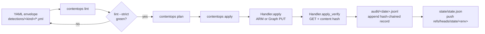
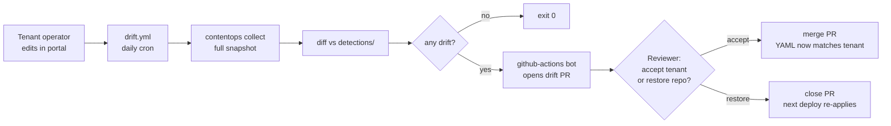
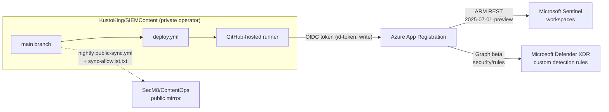

# Architecture

> Canonical reference for how the pipeline is wired together. Read
> [`OPERATOR_GUIDE.md`](../OPERATOR_GUIDE.md) first if you want the
> day-one orientation; this doc is for "how does it actually work."

---

## Vocabulary

These terms appear throughout the codebase and the rest of the docs.
Defined here once.

| Term         | Meaning                                                                                       |
|--------------|-----------------------------------------------------------------------------------------------|
| **Tenant**   | One Microsoft Entra tenant. Single-tenant model — one repo, one tenant. Identified by `AZURE_TENANT_ID`. |
| **Workspace**| One Sentinel-onboarded Log Analytics workspace inside the tenant. Sentinel resources live in `Microsoft.OperationalInsights/workspaces/<name>` + `Microsoft.SecurityInsights/...`. |
| **Envelope** | The on-disk YAML wrapper around an API payload. Carries `id`, `version`, `asset`/`platform`, `status`, `metadata`, `legacy`. See [`contentops/core/envelope.py`](../../contentops/core/envelope.py). |
| **Payload**  | The platform-specific body inside the envelope (`payload:` for v2; `sentinel:`/`defender:` for v1 legacy). Goes to ARM/Graph as the request body. |
| **Asset kind** | A typed enum value naming what the envelope represents (e.g. `sentinel_analytic`, `defender_custom_detection`). Defined in [`contentops/core/asset.py`](../../contentops/core/asset.py). |
| **Handler** | The class that knows how to validate / plan / apply / delete one asset kind. One file per kind under `contentops/handlers/`. |
| **Provider** | A thinner wrapper around a backend HTTP API (ARM, Graph). Handlers compose providers; the Sentinel side is `contentops/providers/sentinel_arm.py`, the Defender side is `contentops/defender/client.py` + `contentops/defender/deploy.py`. |
| **Drift**   | A read-only comparison of remote tenant ↔ local YAML, classifying each remote asset as `new`, `changed`, or `in-sync`. |
<!-- "Operational asset" row removed -- the read-only operational kinds
(incidents, watchlist items, workspace-manager state) and the
``--include-operational`` flag were deleted in the asset-taxonomy
reduction. The 6 surviving kinds are all configuration; the
operational/configuration distinction no longer applies. -->


---

## Visual diagrams

Three Mermaid views of the same machine; the ASCII detail below is
the source of truth for any disagreement.

### 1. Detection lifecycle (one envelope, one apply)



### 2. Drift loop (tenant-edit detection)



### 3. Deployment topology (one runner, one tenant, public mirror)



The state branch (`refs/heads/state/<env>`) and the audit JSONL
artifact are deploy-time outputs of `deploy.yml`; they don't
appear in the topology diagram because they're internal to the
repo, not part of the deploy surface.

---

## End-to-end flow

```
                                  ┌───────────────────────┐
   detections/<kind>/*.yml ─────► │  load_asset           │
                                  │  parse_envelope       │  contentops/core/discovery.py
                                  │  load_rule (legacy)   │  contentops/core/envelope.py
                                  └──────────┬────────────┘
                                             ▼
                              ┌──────────────────────────────┐
                              │  HandlerRegistry.get(asset)  │  contentops/core/registry.py
                              └──────────────┬───────────────┘
                                             ▼
       ┌─────────────────────────────────────┴────────────────────────────────┐
       │ Handler protocol: validate, plan, apply, delete, list_remote, to_envelope │
       │                              contentops/core/handler.py                │
       └─────────┬───────────────────────────────────────┬────────────────────┘
                 ▼                                       ▼
   ┌──────────────────────────────┐       ┌──────────────────────────────────┐
   │  SentinelArmProvider         │       │  Defender client + deploy        │
   │  contentops/providers/         │       │  contentops/defender/client.py     │
   │     sentinel_arm.py          │       │  contentops/defender/deploy.py     │
   └──────────────┬───────────────┘       └────────────────┬─────────────────┘
                  ▼                                        ▼
   ┌──────────────────────────────┐       ┌──────────────────────────────────┐
   │  ARM REST 2025-07-01-preview │       │  Microsoft Graph Security beta   │
   │  management.azure.com        │       │  graph.microsoft.com             │
   │  + Microsoft.SecurityInsights│       │  security/rules                  │
   │    (analytics, hunting,      │       │  (defender_custom_detection)     │
   │     watchlists, connectors)  │       │                                  │
   │  + Microsoft.OperationalInsights │   │                                  │
   │    (parser functions,        │       │                                  │
   │     saved searches)          │       │                                  │
   └──────────────┬────────────────┘     └────────────────┬─────────────────┘
                  ▼                                        ▼
                              ┌─────────────────────────────┐
                              │  TENANT (single)            │
                              └─────────────────────────────┘

   ─── Side effects ──────────────────────────────────────────────────────────

   apply ─► audit/YYYY-MM-DD.jsonl  (hash-chained — contentops/audit/writer.py)
        ─► state/state.json        (last-applied per env — contentops/state.py)

   prune ─► same audit chain
        ─► no state mutation (delete just disappears the asset)

   collect/drift ─► detections/<kind>/<id>.yml (only when drift detected and --write)
              ─► no audit, no state
```

### Visibility + reporting modules (no remote-write side effects)

These modules read from the same envelopes / handlers / workspace KQL
helpers as the deploy path, but never mutate the tenant. They exist
to give operators and SOC managers context — coverage, freshness,
firing patterns — without leaving the CLI.

| Module | Purpose | Output |
|---|---|---|
| [`contentops/navigator/`](../../contentops/navigator/) | MITRE ATT&CK Navigator layer renderer. Three extractors (repo envelopes, deployed Sentinel/Defender rules, live `SecurityAlert` firings) feed `score_techniques()` and `render_layer()`. Stdlib-only, no Jinja2. | JSON layer file uploadable to https://mitre-attack.github.io/attack-navigator/ |
| [`contentops/docs/`](../../contentops/docs/) | Per-detection markdown generator (NVISO Part 4). Pure-function renderer with byte-identical drift gate. Mirrors `contentops/catalog/render.py` shape. | `docs/detections/<asset>/<id>.md` + index |
| [`contentops/tuning.py`](../../contentops/tuning.py) | PR-time tuning-impact preview (NVISO Part 8). Diffs `drift_suppressions.yml` between two refs; resolves envelope id → displayName; renders a markdown blast-radius table for the PR comment. | Markdown report; consumed by `tuning-impact-preview.yml` workflow |
| [`contentops/coverage/d3fend.py`](../../contentops/coverage/d3fend.py) | MITRE D3FEND defensive-axis companion to the ATT&CK coverage report. Reads `metadata.defensiveTechniques: [D3-XXX]` from every envelope. | Markdown + JSON coverage report |
| [`contentops/workspace_kql.py`](../../contentops/workspace_kql.py) | Thin httpx wrapper over the Log Analytics Query API + tenant.yml-driven workspace-ID auto-derive. Shared infra for `silent-rules`, `auto-disabled-rules`, `portfolio --with-telemetry`, `lifecycle promote` (fp_rate gate), `tuning preview`, and `navigator`. | `QueryResult` (rows + column names) |

---

## Alert pipeline

```
Graph alerts_v2 / Sentinel ARM incidents
    |  GraphAlertsProvider (auto-fallback)
    v
NormalizedAlert (in-memory, PII-rich)
    |  normalize_to_entry() -- PII firewall
    v
LedgerEntry (JSONL, PII-free)
    |  build_daily_rollups()
    v
DailyRollupEntry (per date/title/version)
    |  compute_detection_health()
    v
DetectionHealthReport (recommendations)
    |  render_unified_html()
    v
Unified Report (all audiences)
```

### Key modules

| Module | Purpose |
|--------|---------|
| `contentops/alerts/provider.py` | Graph alerts_v2 with Sentinel ARM fallback |
| `contentops/alerts/ledger.py` | PII-free JSONL ledger + watermark |
| `contentops/alerts/sync.py` | Smart lookback + upsert orchestrator |
| `contentops/alerts/daily_store.py` | Idempotent daily rollup aggregation |
| `contentops/alerts/detection_health.py` | Health engine + recommendation engine |
| `contentops/ownership.py` | `config/owners.yml` mapping |
| `contentops/report/unified.py` | Multi-audience HTML renderer |

### Alert-to-detection correlation

Four-tier matching (priority order):

1. **ARM GUID** — `detectorId` from Graph or `relatedAnalyticRuleIds` from Sentinel
2. **Exact title** — `alert.title == detection.displayName`
3. **Alert format prefix** — static prefix from `alertDetailsOverride.alertDisplayNameFormat`
4. **Substring containment** — displayName within alert title or vice versa (min 8 chars)

---

## The handler protocol

Every supported asset kind has one handler under `contentops/handlers/`.
The contract is small, defined in
[`contentops/core/handler.py`](../../contentops/core/handler.py):

```python
class Handler(Protocol):
    asset: ClassVar[Asset]

    def validate(self, loaded: LoadedAsset) -> None: ...
    def plan(self, loaded: LoadedAsset) -> ActionResult: ...
    def apply(self, loaded: LoadedAsset, *, dry_run: bool = False) -> ActionResult: ...
    def delete(self, remote_id: str) -> ActionResult: ...
```

`LoadedAsset` carries `path: Path`, `envelope: EnvelopeV2`, and
`payload: dict[str, Any]`.

Drift-capable handlers additionally implement two methods (see
`DriftCapable` in [`contentops/core/drift.py:42`](../../contentops/core/drift.py)):

```python
def list_remote(self) -> list[dict]: ...
def to_envelope(self, remote: dict) -> dict | None: ...
```

`to_envelope` returns `None` for items the handler intentionally
skips on round-trip — for example Microsoft-shipped or otherwise
unmanaged remote entries that we don't want to import into git. The
watchlist and data-connector handlers both use this to drop remote
artefacts outside the managed set (see
`contentops/handlers/sentinel_watchlist.py`).

### Two ID lookups

Every write-capable handler has to bridge two namespaces:

1. **Envelope id** — the slug we use in YAML (`detections/sentinel_analytic/<id>.yml`).
2. **Remote id / ARM name** — the identifier the API uses (often a GUID).

The mapping is preserved by `metadata.arm_name`, populated on
`collect` and read on `apply`/`delete`. For asset kinds with no
ARM-name field (e.g. Defender custom detections), the upsert key is
`displayName`; for TI indicators it's `externalId`. Each handler
documents its choice; full table in
[`asset-coverage.md`](asset-coverage.md).

### Verification

After each successful PUT/POST, write-capable handlers GET the
resource and compare a content hash. There are two modes:

- **Field hash** — SHA-256 over a deterministic JSON projection of
  named fields (`_HASHED_FIELDS = [...]`). Catches tamper or partial
  writes byte-for-byte.
- **Projection hash** — SHA-256 over a derived dict (e.g. sorted
  trigger names + action types for playbooks). Used where the API
  normalises the body too aggressively for a byte-level hash to
  survive (Logic Apps definition rewrite, automation rule action
  parameter shuffling). Documented limitations are called out per
  handler in [`asset-coverage.md`](asset-coverage.md).

Mismatch is non-fatal at the per-asset level — the result is
`success` with `verified=False` — but the batch run exits 1 and an
audit record marks it `failed`. This catches "PUT returned 200 but
the body that came back is not what we sent" without bricking the
whole apply.

### ETag concurrency

Sentinel ARM resources expose ETags; write-capable Sentinel handlers
read the existing remote first, capture the ETag, and PUT with
`If-Match`. A 412 Precondition Failed surfaces as `ETAG_CONFLICT_MESSAGE`
("rerun contentops plan and resolve drift"), never a stack trace. See
[`contentops/handlers/_verify.py`](../../contentops/handlers/_verify.py).

The Defender Graph beta API does **not** expose ETags. Defender
handlers do post-apply hash verification only; concurrent edits
race and the loser's PATCH wins.

---

## Envelope schema

Two formats are accepted; both produce the same `EnvelopeV2`
in-memory.

### V1 (legacy)

```yaml
id: sentinel-<guid>
version: 0.0.0
platform: sentinel        # or "defender"
status: production
legacy: true              # required if no metadata block
sentinel:                 # or "defender:" — the platform name
  kind: Scheduled
  ...                     # API payload
```

Loaded by [`load_rule()` in `contentops/utils/yaml_io.py:90`](../../contentops/utils/yaml_io.py).
The platform key is the payload key — `sentinel:` for analytics,
`defender:` for custom detections. `legacy: true` is the documented
escape hatch when the file pre-dates the v2 metadata requirement.
<!-- Previously cross-referenced ``scripts/grandfather_legacy.py``, the
one-shot helper that injected ``legacy: true`` into 159 grandfathered
detections. Both the script and the allowlist were deleted in the
v1-legacy hard cut (PR #122/#125); v1 envelopes are still parseable
but no new ones should be authored. -->


### V2

```yaml
id: <kebab-slug>
version: 1.0.0
asset: sentinel_analytic   # one of contentops.core.asset.Asset values
status: production
metadata:                  # required for detection assets unless legacy:true
  owner: secops@example.com
  runbookUrl: https://runbooks.example.com/<id>
  severity: medium         # informational | low | medium | high
  tactics: [Persistence]
  techniques: [T1098]
  expectedAlertsPerDay: 1
  fpHandling: "Triage manually."
  cohort: optional
  arm_name: optional       # set by `collect` to preserve remote name
payload:
  ...                      # API payload, same keys as v1's sentinel:/defender:
```

Loaded by [`parse_envelope()` in `contentops/core/envelope.py:51`](../../contentops/core/envelope.py).
Detection assets (`sentinel_analytic`, `sentinel_hunting`,
`defender_custom_detection`) **require** the metadata block — the
parser raises if it's missing and `legacy:true` isn't set. This is
how the v2 quality bar is enforced.

### Status semantics

`status` is a free string today but the pipeline reads four values:

| Status         | Apply behaviour                                                    | Plan action |
|----------------|--------------------------------------------------------------------|-------------|
| `experimental` | Skip — never deployed                                              | `SKIP`      |
| `production`   | Deploy as-is                                                       | `UPDATE`    |
| `test`         | Deploy as-is. Routing to a dedicated test workspace is a Phase-3 deliverable; see `roadmap.md` F8. | `UPDATE`    |
| `deprecated`   | Deploy with `enabled:false` (Sentinel) / `isEnabled:false` (Defender) | `DISABLE`   |

All six current asset kinds support `delete`. (The historical
singleton-like kinds that refused deletion — they would have taken
Sentinel off the workspace — were removed in the asset-taxonomy
reduction to 6 kinds and no longer exist.) The `NotSupportedError`
that today's handlers raise is only a wiring guard for a missing
provider/client, not a deliberate refusal to delete.

### `localCustomization: true`

Top-level flag. When set on an envelope, `apply` skips that asset
unless `--force-overwrite` is passed. Pattern lifted from
Sentinel-as-Code Wave 2: an analyst hand-tunes a threshold or KQL
filter, doesn't want a future bulk apply to flatten the change.
Set/cleared via `contentops lock <id>` / `contentops unlock <id>`. See
`_is_locked()` in [`contentops/cli/commands/_shared.py:259`](../../contentops/cli/commands/_shared.py).

### `arm_name`

Optional `metadata.arm_name`. Preserves the remote ARM resource
name when an envelope's id is a slugified displayName.
`contentops collect` populates it; `apply`/`delete` consult it to
build the right URL. Without `arm_name`, the handler falls back to
the envelope id to construct the remote resource name.

---

## Audit trail — the hash chain

Every `apply` and `prune` invocation that touches the wire writes
one record per asset to `audit/YYYY-MM-DD.jsonl`. Records are
hash-chained: each record's `prev_hash` is the SHA-256 of the
previous record's serialised JSON; `record_hash` is the SHA-256 of
its own JSON (with `record_hash` itself stripped). The first record
ever uses `prev_hash = "0" * 64` (the `ZERO_HASH` sentinel in
[`contentops/audit/writer.py:24`](../../contentops/audit/writer.py)).

Schema, query examples, and retention details are in
[`audit-trail.md`](audit-trail.md).

`contentops audit verify` ([`contentops/cli/commands/audit.py:28`](../../contentops/cli/commands/audit.py))
walks every `audit/*.jsonl` file in date order and:

1. Recomputes each record's hash (must match `record_hash`).
2. Confirms each record's `prev_hash` equals the previous record's
   `record_hash`.

A break in either check is reported with the file + line number; an
attacker who edits a record has to recompute every later record's
hash, and the chain head is committed to git so silent rewrites are
visible in `git log`.

Audit files are also uploaded as 90-day GitHub Actions artefacts
from `deploy.yml` / `prune.yml` / `retry-failed.yml` — the in-repo
copy is the durable record, the artefacts are short-term forensics.

---

## State file

Per-env JSON at `state/state.json` locally, or `state/<env>/state.json`
in CI. Schema lives in [`contentops/state.py`](../../contentops/state.py):

```python
EnvState
├── schema_version: "1.0"
├── env: str                                # e.g. "production"
├── last_apply_sha: str                     # full git SHA
├── last_apply_at: str                      # ISO 8601 UTC
└── managed_assets: dict[asset_kind, dict[envelope_id, AssetStateEntry]]
                                            # AssetStateEntry: remote_id, last_applied_at,
                                            #                  last_applied_sha, status
```

Read/written by:

- **`apply`** — appends every applied (envelope_id, asset_kind,
  remote_id, status) tuple after a successful run
  ([`contentops/cli/commands/apply.py`](../../contentops/cli/commands/apply.py)).
- **`prune`** — could consult state to scope orphan detection, but
  today walks live `list_remote()` and compares to local YAML
  directly. State is advisory.
- **`drift`** — same; state is not strictly required because git is
  the truth.
- **`contentops state show`** — print current state.
- **`contentops state forget <id> --asset <kind>`** — drop an entry
  (e.g. after a manual portal cleanup).

Storage convention in CI is an orphan branch named `state/<env>`
(per DESIGN §13) so the state's own history is auditable but
doesn't pollute `main`. **F19 (`contentops state sync`) wired
this**: `deploy.yml`, `promote-to-integration.yml`, `prune.yml`, and
`retry-failed.yml` all call `state sync pull` before their mutation
step and `state sync push` after (gated on non-dry-run). See
[`contentops/state_sync.py`](../../contentops/state_sync.py) and
the resolved G15 row in [`gap-assessment.md`](gap-assessment.md).

State is best-effort. `apply` never fails because it couldn't write
state; the pipeline keeps working without it.

---

## Validation pipeline

What runs at PR time, in order:

1. **`contentops validate`** (legacy v1 entrypoint) — Pydantic
   schema, unique ids, unique Defender displayNames. Still wired in
   `validate.yml`.
2. **`contentops lint`** — KQL static checks (KQL001-KQL007),
   payload-contract checks (PAYLOAD001 + PAYLOAD002), snippet-
   substitution rules (KQLOVERRIDE001-004), and `--strict` mode
   adds policy rule KQL101 (`\| take` / `\| limit` forbidden).
   See [`contentops/lint/kql.py`](../../contentops/lint/kql.py),
   [`contentops/lint/payload.py`](../../contentops/lint/payload.py),
   [`contentops/lint/snippets.py`](../../contentops/lint/snippets.py),
   and [`contentops/lint/strict_rules.py`](../../contentops/lint/strict_rules.py).
3. **`contentops plan`** — runs each handler's `validate()` (e.g.
   templateVersion coupling check) and `plan()`; emits the
   intended action per asset.
4. **Dependency check** — `detections/dependencies.yml` declares
   prerequisites (parsers, watchlists, etc.). `validate_dependencies`
   in [`contentops/core/dependencies.py`](../../contentops/core/dependencies.py)
   blocks merge if a referenced prerequisite isn't authored.

Every CI gate is read-only — no Azure auth required at PR time.
Real API calls happen on `main` merge via `deploy.yml`.

---

## Asset taxonomy

[`contentops/core/asset.py`](../../contentops/core/asset.py) declares
**6 asset kinds** today (the focused taxonomy after the Phase 1
reduction from 27 broader kinds): `sentinel_analytic`,
`sentinel_hunting`, `sentinel_watchlist`, `sentinel_parser`,
`sentinel_data_connector`, `defender_custom_detection`. The 13
deleted handlers (workspace manager, source controls, incidents,
incident tasks, watchlist items, etc.) can be rebuilt from git
history if a real use case surfaces; out of scope for the focused
detection-engineering product. Full per-asset coverage table including
endpoint, RBAC, hash projection, and live-test status is in
[`asset-coverage.md`](asset-coverage.md).

All six current asset kinds are **write-capable and drift-capable**:
`apply` performs CRUD, and `drift` / `collect` round-trip them.

<!-- Earlier revisions split asset kinds into three operational
categories (write-capable/drift-capable, write-capable/singleton, and
read-only/collect-only). The latter two no longer exist: the
singleton-like kinds (``sentinel_settings``, ``sentinel_onboarding``)
that refused ``delete``, the read-only operational kinds (incidents,
incident tasks, watchlist items, all four workspace-manager kinds),
the ``OPERATIONAL_ASSETS`` frozenset, and the ``--include-operational``
opt-in flag were all removed in the asset-taxonomy reduction. Only the
6 configuration kinds are managed today, and all of them are
write-capable and drift-capable. -->

---

## What this design *isn't*

- Not a replacement for the Sentinel UI for ad-hoc investigation.
- Not a workspace bootstrapper at scale — `contentops bootstrap`
  creates one workspace; multi-workspace orchestration is out of
  scope (single-tenant model).
- Not a multi-tenant fan-out platform. The single-tenant constraint
  is load-bearing in [`contentops/config.py`](../../contentops/config.py)
  and the one-tenant assumption permeates auth, state, and audit.
- Not a SOAR. Playbooks are deployed by us; their *internals* are
  authored in the Logic Apps designer.

For deeper rationale see [`../../DESIGN.md`](../../DESIGN.md)
sections 1 (goals/non-goals), 8 (drift + delete), 13 (state), and 17
(risks).
