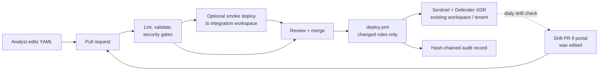

# How ContentOps works

> A short, non-code overview for security, platform, and architecture
> reviewers: what the tool does, what it does **not** do, how it
> authenticates, and what each GitHub Actions pipeline is for. For
> internals see [`architecture.md`](architecture.md); for the full
> workflow table (permissions, runtimes) see [`workflows.md`](workflows.md).

---

## In one sentence

ContentOps is a **detection-as-code** pipeline: detection content is
kept as YAML in a private Git repository, reviewed and tested in pull
requests, and deployed by GitHub Actions to an **existing** Microsoft
Sentinel workspace and Microsoft Defender XDR tenant.

## What it manages

Six kinds of detection content, nothing else
([`asset-coverage.md`](asset-coverage.md)):

- Sentinel analytic rules
- Sentinel hunting queries
- Sentinel watchlists
- Sentinel parsers (KQL functions)
- Sentinel data-connector configuration
- Defender XDR custom detection rules

## What it does NOT do

ContentOps **does not provision or change infrastructure**. It does not
create or modify networks, VMs, storage accounts, Key Vaults, data
collection rules or agents, role assignments, App Registrations, or
Azure Policy. The Sentinel workspace, the App Registration, and its
role assignments are prerequisites that exist before ContentOps runs.
No infrastructure-as-code tooling is needed to operate ContentOps.

The single exception is optional and opt-in: the manual
`promote-to-integration.yml` workflow can create an *integration* (test)
resource group + Log Analytics workspace and onboard Sentinel on it if
they do not exist yet. An integration workspace is **not required**:
a deployment with only a production workspace never runs this, and the
PR-time integration smoke deploy skips itself automatically.

## Technical details

| Topic | How |
|---|---|
| **Runtime** | GitHub Actions runners executing the `contentops` Python CLI. No agents, services, or servers are installed in the tenant. |
| **Authentication** | OIDC workload-identity federation from GitHub to an Entra App Registration. No client secrets stored in GitHub. See [`authentication-setup.md`](../operations/authentication-setup.md). |
| **APIs called** | Azure Resource Manager (`Microsoft.SecurityInsights` and `Microsoft.OperationalInsights` saved searches/functions on the workspace) and Microsoft Graph `security/rules` (Defender custom detections). |
| **Permissions** | Least privilege, scoped to the workspace resource group: `Microsoft Sentinel Contributor` + `Log Analytics Contributor`; Graph `CustomDetection.ReadWrite.All`. Optional read-only Graph scopes: `ThreatHunting.Read.All`, `SecurityAlert.Read.All`. Read-only roles suffice for reporting/drift-only use. |
| **Tenant identifiers** | Kept in a GitHub secret (`TENANT_CONFIG_YAML`), never committed. gitleaks blocks GUID leaks in CI. |
| **Change control** | Every change is a pull request. Production deploys run under the `production` GitHub Environment, where required reviewers can be enforced. Destructive actions (prune, rollback) are manual, dry-run by default, and need an explicit confirmation. |
| **Audit** | Every write is appended to a hash-chained, append-only audit log ([`audit-trail.md`](audit-trail.md)), verified weekly. |
| **Source of truth** | Git. Portal-side edits are detected daily and raised as a PR, so the repository stays authoritative. |

## Flow

## The pipelines

### Deploy

- `deploy.yml`: on merge to `main`, deploys changed detections to the production Sentinel workspace(s) and Defender XDR, then runs a smoke check and verifies the audit chain.
- `integration-deploy.yml`: *optional*; on a PR, deploys changed detections to an integration workspace as a smoke test. Skips itself when no integration workspace is configured.
- `promote-to-integration.yml`: *optional, manual*; copies production content into an integration workspace (see the exception above).
- `retry-failed.yml`: manual; re-deploys only the rules that failed in the last run.

### Pull-request quality and security gates (no Azure access)

- `ci.yml`: unit tests, dependency audit (pip-audit), CLI smoke test, strict KQL compile against table schemas.
- `validate.yml`: YAML schema, lint, deployment plan, version-bump checks.
- `sast.yml`: static analysis (bandit, semgrep).
- `secret-scan.yml`: secret scanning (gitleaks).
- `dco.yml`: commit sign-off check.
- `spelling.yml`: spelling check.
- `coverage.yml`: MITRE ATT&CK coverage report.
- `production-promotion-check.yml`: pre-promotion checks on detection changes.
- `tuning-impact-preview.yml`: comments the 30-day alert impact of a proposed suppression.
- `e2e-capability-tests.yml`: exercises every CLI command (mocked by default).
- `integration.yml`: live tests against an integration workspace; explicit opt-in only.

### Operations (manual; go through a PR or require approval)

- `emergency-disable.yml`: opens a PR that disables one noisy rule.
- `lock-unlock.yml`: opens a PR that locks or unlocks one rule.
- `rollback.yml`: re-deploys detection content as it was at a given commit; dry-run by default.
- `prune.yml`: deletes tenant rules that no longer exist in Git; dry-run by default.
- `state-adopt.yml`: records rules already in sync with the tenant as managed; read-only towards Azure.

### Monitoring and drift (scheduled, mostly read-only)

- `drift.yml` (daily): compares the tenant with Git; opens a PR when the portal was edited.
- `collect.yml` (weekly): exports deployed content back to YAML and opens a PR.
- `conformance.yml` (weekly): read-only health checks on configuration, auth, and reachability.
- `silent-rules.yml` (weekly): lists rules that produced no alerts.
- `audit-verify.yml` (weekly): verifies the audit hash chain.
- `defender-graph-probe.yml` (weekly): checks whether Microsoft has made new Defender APIs generally available.
- `references-check.yml` (weekly): finds broken reference links in detection metadata.

### Reporting

- `alerts-report.yml` (daily): alert volume, detection health, and trend (no PII).
- `portfolio.yml` (daily): per-detection inventory summary.
- `report.yml` (weekly and on merge): detection inventory and posture report.
- `status-refresh.yml` (daily): regenerates the status pages.

### Upstream refresh (open PRs, never deploy)

- `kql-schemas-refresh.yml`: refreshes KQL table schemas used by lint.
- `attack-matrix-refresh.yml`: refreshes the MITRE ATT&CK matrix.
- `upstream-watchers.yml`: tracks Microsoft content-hub and rule-template changes.

### Release

- `release.yml`: publishes a GitHub Release when a version tag is pushed.
- `public-sync.yml`: source repository only; one-way publish of the allowlisted tool code to the public mirror. No tenant data is published.
